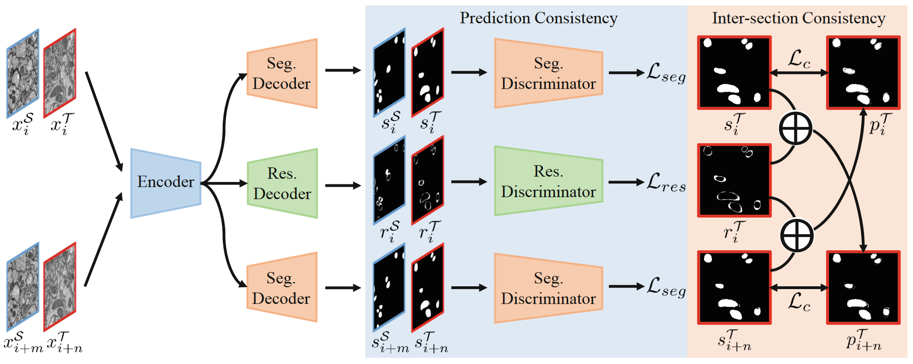
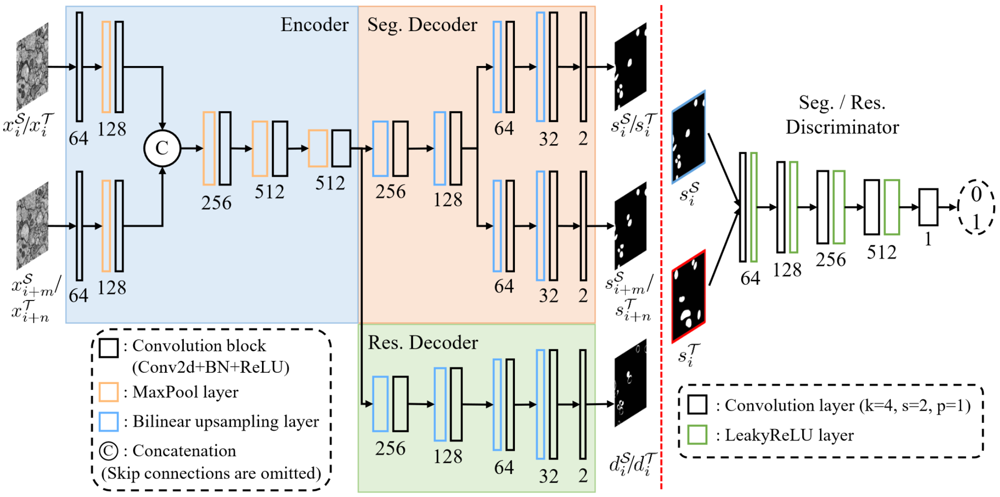
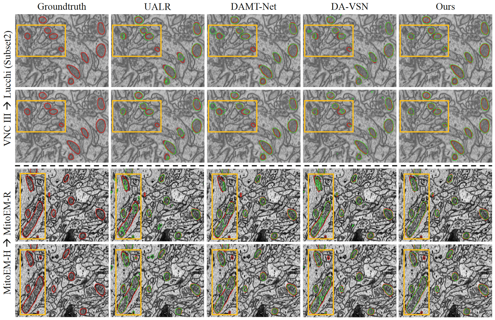

# Domain Adaptive Mitochondria Segmentation via Enforcing Inter-Section Consistency [[paper](https://link.springer.com/chapter/10.1007/978-3-031-16440-8_9)]

**Accepted by MICCAI-2022**

**Wei Huang**, Xiaoyu Liu, Zhen Cheng, Yueyi Zhang, and Zhiwei Xiong*

University of Science and Technology of China (USTC), Hefei, China

Institute of Artificial Intelligence, Hefei Comprehensive National Science Center, Hefei, China

*Corresponding Author

## Abstract
Deep learning-based methods for mitochondria segmentation require sufficient annotations on Electron Microscopy (EM) volumes, which are often expensive and time-consuming to collect. Recently, Unsupervised Domain Adaptation (UDA) has been proposed to avoid annotating on target EM volumes by exploiting annotated source EM volumes. However, existing UDA methods for mitochondria segmentation only address the intra-section gap between source and target volumes but ignore the inter-section gap between them, which restricts the generalization capability of the learned model on target volumes. In this paper, for the first time, we propose a domain adaptive mitochondria segmentation method via enforcing inter-section consistency. The key idea is to learn an inter-section residual on the segmentation results of adjacent sections using a CNN. The inter-section residuals predicted from source and target volumes are then aligned via adversarial learning. Meanwhile, guided by the learned inter-section residual, we can generate pseudo labels to supervise the segmentation of adjacent sections inside the target volume, which further enforces inter-section consistency. Extensive experiments demonstrate the superiority of our proposed method on four representative and diverse EM datasets. Code is available at https://github.com/weih527/DA-ISC.

## Framework and Network Architecture




## Environment
This code was tested with Pytorch 1.0.1 (later versions may work), CUDA 9.0, Python 3.7.4 and Ubuntu 16.04. It is worth mentioning that, besides some commonly used image processing packages.

If you have a [Docker](https://www.docker.com/) environment, we strongly recommend you to pull our image as follows,
```shell
docker pull registry.cn-hangzhou.aliyuncs.com/renwu527/auto-emseg:v5.4
```
or
```shell
docker pull renwu527/auto-emseg:v5.4
```
Besides, we need to instanll some python packages manually:
```shell
pip install albumentations
pip uninstall opencv-python  # remove the old version
pip install opencv-python
```

The entire installed python packages can be found in 'requirements.txt'

## Datasets
### Data Properties

|Datasets|VNC III|Lucchi|MitoEM-R|MitoEM-H|
|-|-|-|-|-|
|Organism|Drosophila|Mouse|Rat|Human|
|Tissue|Ventral nerve cord|Hippocampus|Cortex|Cortex|
|Device|ssTEM|FIB-SEM|mbSEM|mbSEM|
|Resolution|50x5x5 nm|5x5x5 nm|30x8x8 nm|30x8x8 nm|
|Training set|20x1024x1024|165x768x1024|400x4096x4096|400x4096x4096|
|Test set|None|165x768x1024|100x4096x4096|100x4096x4096|
|Website|[GitHub](https://github.com/unidesigner/groundtruth-drosophila-vnc)|[EPFL](https://www.epfl.ch/labs/cvlab/data/data-em/)|[MitoEM](https://mitoem.grand-challenge.org/)|[MitoEM](https://mitoem.grand-challenge.org/)|

**You can download our processed data directly from  [GoogleDrive](https://drive.google.com/drive/folders/15oFhlWoBACOpyEUDx2-wbnUj3aIwYydv?usp=sharing) or  [BaiduYun](https://pan.baidu.com/s/15BS0Sa_LPuyKxNJaAob4Eg) (Access code: weih). However, because the MitoEM dataset is too large (>10GB), we cannot put it in our cloud storage. It is recommended to download it from the official website.**

### Data Tree
```python
|--./data
|   |--Lucchi
|   |   |--testing
|   |   |--testing_groundtruth
|   |   |--training
|   |   |--training_groundtruth
|   |--Mito
|   |   |--human
|   |   |   |--testing.hdf
|   |   |   |--testing_groundtruth.hdf
|   |   |   |--training.hdf
|   |   |   |--training_groundtruth.hdf
|   |   |--rat
|   |   |   |--testing.hdf
|   |   |   |--testing_groundtruth.hdf
|   |   |   |--training.hdf
|   |   |   |--training_groundtruth.hdf
|   |--VNC3
|   |   |--training
|   |   |--training_groundtruth
```

## Training
We train our method on one NVIDIA Tianxp GPU.
Our training log files can be found in './logs'.

### VNC III --> Lucchi (Subset1)
```python
cd scripts
python main.py -c vnc2lucchi1
```

### VNC III --> Lucchi (Subset2)
```python
cd scripts
python main.py -c vnc2lucchi2
```

### MitoEM-R --> MitoEM-H
```python
cd scripts
python main_mito.py -c mitor2h
```

### MitoEM-H --> MitoEM-R
```python
cd scripts
python main_mito.py -c mitoh2r
```

## Inference
We test our trained model on one NVIDIA Tianxp GPU.

**We store our trained models at [GoogleDrive](https://drive.google.com/drive/folders/1OiL9-qcfsdncVJhvg0ELmTPqhQhneUmT?usp=sharing) or [BaiduYun](https://pan.baidu.com/s/1Jg8XVzcTvhrGnOXXMM4Alg) (Access code: weih)**

### VNC III --> Lucchi (Subset1)
```python
cd scripts
python inference.py -c vnc2lucchi1 -mn vnc2lucchi1 -sw
```
Print
```python
cfg_file: vnc2lucchi1.yaml
out_path: ../inference/vnc2lucchi1
Begin inference...
Prediction time (s): 138.40105080604553
Measure on mAP, F1, MCC, and IoU...
mAP=0.8948, F1=0.8129, MCC=0.8053, IoU=0.6865
Measurement time (s): 917.6475455760956
Done
```
### VNC III --> Lucchi (Subset2)
```python
cd scripts
python inference.py -c vnc2lucchi2 -mn vnc2lucchi2 -sw
```
Print
```python
cfg_file: vnc2lucchi2.yaml
out_path: ../inference/vnc2lucchi2
Begin inference...
Prediction time (s): 144.69077563285828
Measure on mAP, F1, MCC, and IoU...
mAP=0.9244, F1=0.8518, MCC=0.8448, IoU=0.7431
Measurement time (s): 912.5876989364624
Done
```

### MitoEM-R --> MitoEM-H
**It needs large memory for quantitative measurement (>50GB)**

```python
cd scripts
python inference_mito.py -c mitor2h -mn mitor2h -sw
```
Print
```python
cfg_file: mitor2h.yaml
out_path: ../inference/mitor2h
Load ../data/Mito/human/testing.hdf
raw shape: (100, 4096, 4096)
padded raw shape: (100, 4608, 4608)
iters: 6336
Load ../data/Mito/human/testing_groundtruth.hdf
Begin inference...
the number of sub-volume: 6336
Prediction time (s): 1438.0159723758698
Measure on mAP, F1, MCC, and IoU...
mAP=0.9255, F1=0.8556, MCC=0.8493, IoU=0.7477
```

### MitoEM-H --> MitoEM-R
**It needs large memory for quantitative measurement (>50GB)**

```python
cd scripts
python inference_mito.py -c mitoh2r -mn mitoh2r -sw
```
Print
```python
mAP=0.9682, F1=0.8851, MCC=0.8829, IoU=0.7941
```

## Visual Results


## Contact
If you have any problem with the released code, please do not hesitate to contact me by email (weih527@mail.ustc.edu.cn).
